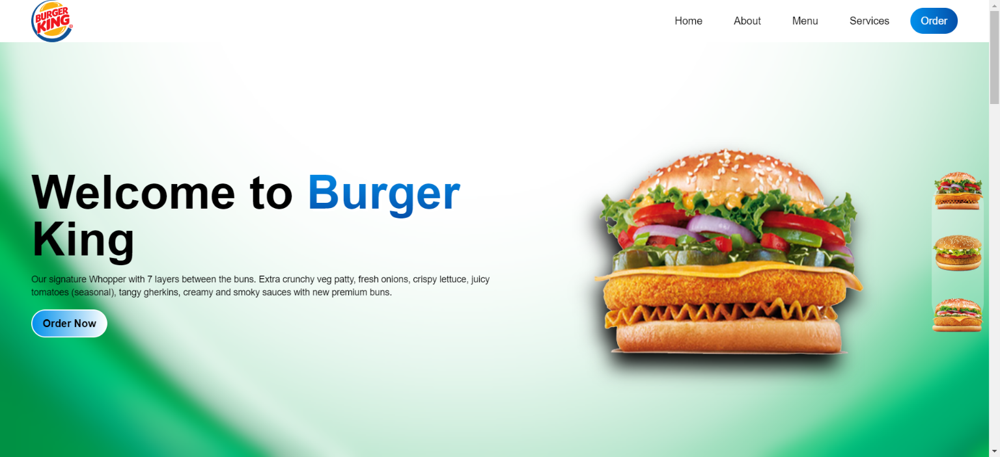

# BurgerKing Demo

This project is a demonstration website inspired by the design of Burger King's official website. It is built using React and Tailwind CSS.



## Features

- Replicates the design layout of Burger King's website
- Built with React for dynamic and interactive components
- Styled using Tailwind CSS for responsive design and modern aesthetics

## Installation

To run this project locally, follow these steps:

1. Clone the repository:

```bash
git clone https://github.com/asha-saini06/BurgerKing.git
```

2. Navigate to the project directory:

```bash
cd BurgerKing
```

3. Install the dependencies:

```bash
npm install
```

4. Start the development server:

```bash
npm start
```

5. Open your browser and visit `http://localhost:3000` to view the website.

## Contributing

Contributions are welcome! If you'd like to contribute to this project, please fork the repository and submit a pull request.
